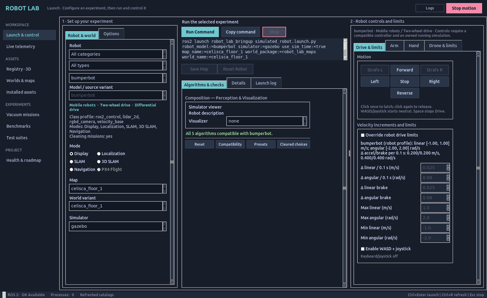

# Robot Lab GUI workspace

## Run the GUI

Start the rebuilt GUI from a sourced workspace:

```bash
source scripts/ssd_env.sh
source /opt/ros/humble/setup.bash
source install/setup.bash
ros2 run robot_lab_gui robot_lab_gui
```

Launch uses columns. Set up the experiment on the left, review its command
and algorithms in the middle, and use **Robot controls and limits** on the
right. Drag the control-column divider to change its width. In smaller windows,
**Set up / Command & algorithms** switch the left content while controls stay
visible on the right. Panels scroll to keep limits and options accessible.



1. Choose a robot **category**, then a **type**. Mobile robots include
   two-wheel and four-wheel drive. Legged robots include two legs, four legs
   and wheeled legs. Manipulators distinguish single and dual arms; mobile
   manipulators distinguish their arm arrangements. Drones and hands have
   separate categories. **All categories / All types** restores the full list.
2. Select a complete parent model and its exact source variant. Blue tags
   describe its structure and steering arrangement. A tag is not a promise
   that every controller, mode or simulator is qualified. Isolated robot
   parts remain under their parent in Registry.
3. Select the map family, world variant, mode and simulator. Unsupported
   modes retain their explanation. **Options** contains viewer choices,
   saved profiles and experimental policy settings.
4. Review **Algorithms & checks**. Compatible defaults and the command update
   from the selection. **Run Command**, **Copy command** and the preview use
   the same resolved arguments. **Details** shows validation and paths;
   **Launch log** shows the owned launch output.
5. Choose a control page in the right column:
   - **Drive & limits:** motion pad, applicable 4WS steering selection,
     increments/braking and velocity limits, WASD and joystick enablement.
     The resolved robot limits appear above override fields; unchecked
     overrides leave those fields disabled. Input enablement starts neutral.
   - **Arm:** joint feedback, native joint limits, jog increment, Home,
     Cancel/Stop and qualified Cartesian Plan/Execute. Controls require the
     selected, owned, running native Panda and fresh measured feedback.
   - **Hand:** opening, force limit, Open/Close/Set, Cancel/Stop and the
     optional grasp fixture for the next Run. The native Panda remains the
     measured hand integration; dexterous-hand imports do not gain it.
   - **Drone & limits:** Takeoff, Hold, Land, Altitude Up/Down and manual
     velocity limits. **Open XY/yaw Drive** switches to the motion pad.
     Use the [X500 guide](px4_x500.md) for the measured Flight workflow.

**Stop motion** calls the existing Drive stop and Arm/Hand hold controls.
Use **Land** for a flying drone and **Stop** beside Run to stop the launch.
**Logs** toggles the shared console without changing the experiment.

The sidebar opens Live telemetry, Registry 3D, Worlds/maps, installed assets,
missions, benchmarks, test suites and Health/roadmap. Registry has independent
robot category/type filters; search also finds structural tags. Its adjustable
split shows the grouped catalog beside native 3D or source details.
[Registry 3D controls](registry-3d.md) inspect geometry without commanding the
robot or changing the current launch selection.

See the [done/remaining checklist](../status/CHECKLIST.md). A selectable source
model or a 3D preview does not qualify walking, flight or manipulation.
