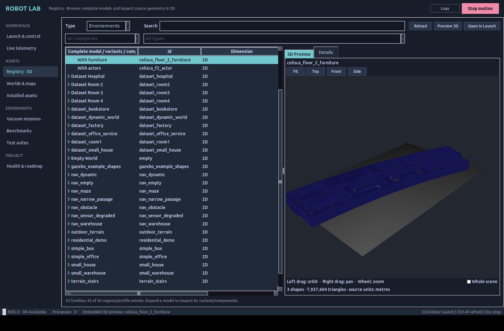

# Inspect robots and worlds inside the GUI

Documentation reviewed October 7, 2026 against runtime checkpoint `091d388`.
Read [current status](../status/CURRENT_STATUS.md) for available workflows and
remaining qualification; evidence below retains its named source stages.

## Run the embedded viewer

Open **Registry · 3D** from the sidebar, choose **Robots** or **Environments**, select an entry and
click **Preview 3D**. The geometry appears in the Registry's **3D Preview**
pane inside Robot Lab GUI. The same button in **Worlds** and
**Installed Extensions** opens this pane.

| Control | Action |
|---|---|
| Left mouse drag | Orbit around the model |
| Right mouse drag | Pan the camera |
| Mouse wheel | Zoom |
| Fit | Frame the model or building |
| Top / Front / Side | Inspect an axis-aligned view |
| Whole scene | Include remote authored objects in Fit |

The preview reads the installed source geometry in metres: URDF joint and
visual frames, native MuJoCo nominal/keyframe geometry, and SDF world/model
includes. It is a static inspection view. Use Run and Live Monitor for actual
physics, sensor and controller feedback. Previewing an asset preserves the
current launch selection and command; it also works while an owned simulation
is running. Large meshes prepare in the background, with buffers on the SSD.
Declared colors are displayed; embedded mesh textures are not reconstructed.

Robot and map selectors now show parent families. **Model/source variant**
and **World variant** select the exact executable profile. For example,
TurtleBot3 contains Burger/Waffle/Waffle Pi, Celisca floor 2 contains shell,
furniture and actors, and R2 contains complete source revisions and retained
subassemblies. Search still finds the original profile or registry ID.

Use Registry's category/type filters and tagged search; drag its divider to
resize the catalog beside native 3D/details. Expand a Registry family to inspect its variants and components. A forearm
can be previewed, but **Open in Launch** is disabled for an isolated component.
Complete R2 and Valkyrie source assemblies already contain their corresponding
parts. Unattached grippers stay in a component library until a compatible
mount is defined; the GUI does not guess mounting transforms. Changing a
source variant retains that profile's controller and backend restrictions.

If preparation or rendering fails, the pane reports the error and Console
contains the loader details. The viewer uses Linux Tk/GLX, PyOpenGL and
Trimesh; ROS package dependencies declare those libraries. The checked
installation supports both native MJCF and downloaded URDF/SDF assets.

The October 8 hospital derivatives repair the exact reviewed extreme fixture
poses and preserve Gazebo's Collada node frames. Original sources and failed
trials remain on SSD. Both corrected hospital variants render in the native
viewport; see [the repair evidence](../status/evidence/extensions-finish-2026-10-08/README.md).
Fit remains a camera operation. Static furniture snapshots, floor/spawn and
short navigation screens have separate evidence; actor, upper-floor and wider
mission qualification remains in R6.6.

[Actual rendered scenes, camera-input checks and live-plant regression](../status/evidence/registry-3d-2026-10-07/README.md)
record the tested scope. Preview availability does not qualify a robot mission.
